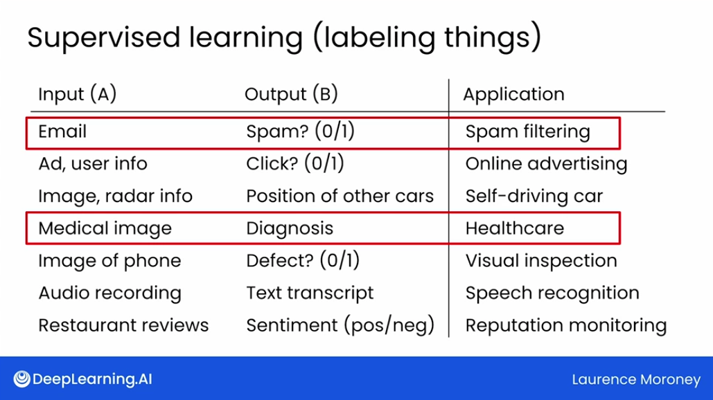
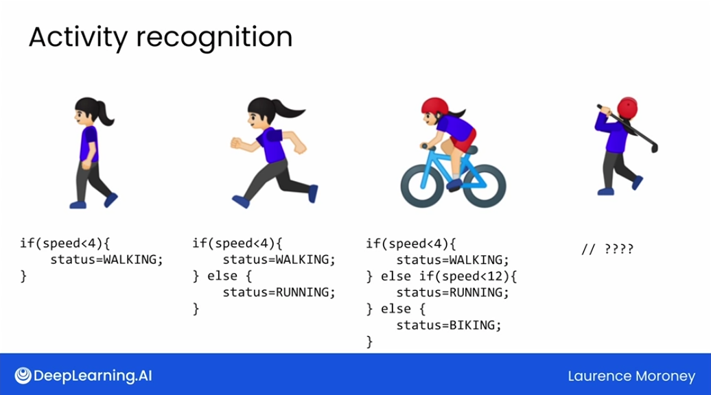
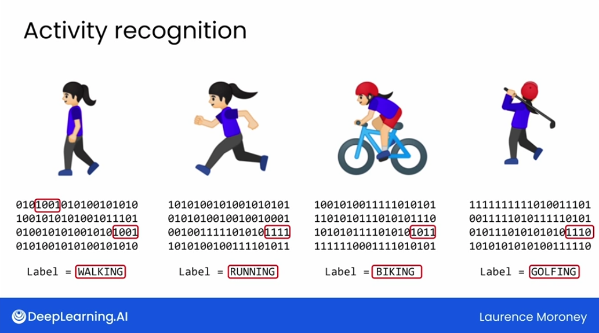
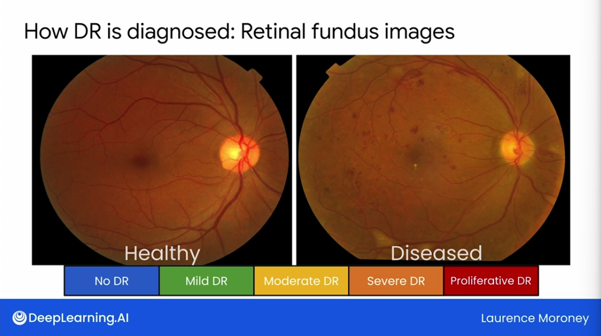
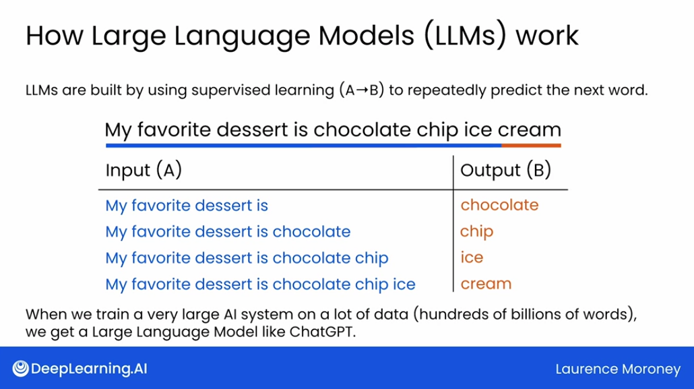
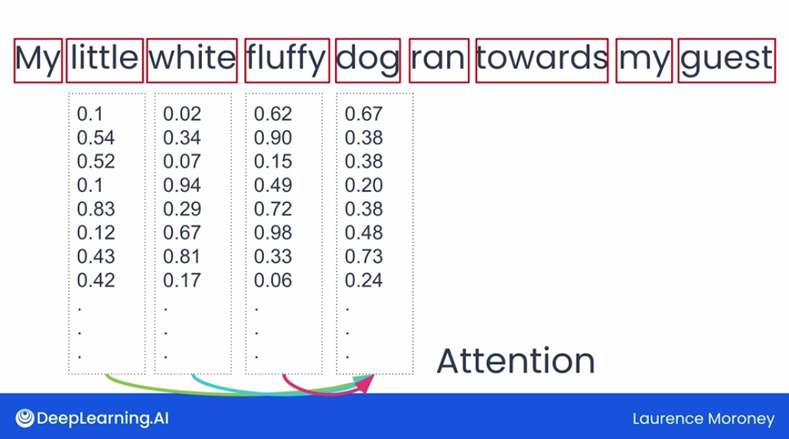
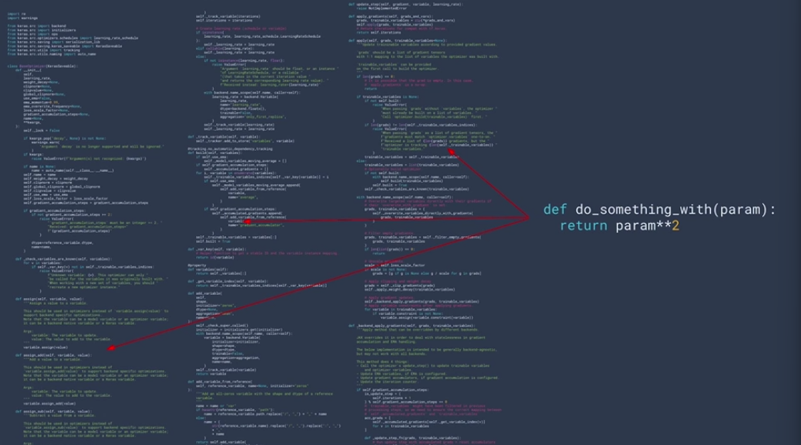
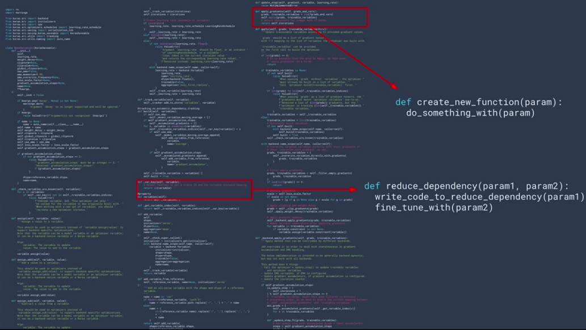

## Setting up your Jupyter environment

```bash
asdf install python anaconda3-5.3.1
asdf local python anaconda3-5.3.1
pip install notebook
python -m jupyterlab  
```

## Week 1

### What is Machine Learning?

- _Transformer_ is particularly well suited for powering large language models
- If you can have the computer recognize _features_ in the same way that people or animals do and learn to put these features together to make an interpretation that what it's looking at is a cat, then you can say that the computer program is artificially intelligent

### Supervised Learning



 vs

- Are they walking? Are they running? Are they biking or doing something else? You could, for example, use the device sensor speed data and write a rule that decides that if the speed is below a certain value, say 4 mph, then the device wearer is probably walking
- You have the data, you have a rule, you get an answer, and then you can extend this to determine if they are running by extending the rule


- Used doctors to label images to diagnose diabetic retinopathy. 
- Model was able to learn to identify diabetic retinopathy from images, but also additional features not expected e.g. birth assigned gender of patient with 97% accuracy




### Transformers

- The big idea behind transformers is that they process all parts of the data simultaneously in parallel

- Consider this sentence: "In Ireland, I went to secondary school, so I had to study ..." 
- How would you finish this sentence? Let's explore that a little bit
- As a human, you paid attention to those words and the full context of the sentence may lead you to predict that the blank, the next token is Irish or _Gaelic_ indicating the language, and you'll be right
- That's what gives the title to the paper that presented transformers
- _Attention is all you need_

There are two key concepts that form the foundation of how transformers work
- _Attention_ allows the model to focus on specific parts of the input text when predicting the next word, like you just did with my secondary school example sentence
- For example, if you had a sentence like _my little white fluffy dog ran towards my guest_, the attention mechanism would allow for the model to focus on the adjectives, little, white, and fluffy when predicting the meaning of the noun dog
- The model might predict _and greeted them enthusiastically_ as the text that completes the sentence


- Text is broken down into pieces called _tokens_, which are mostly individual words, but they're occasionally pieces of words
- Each word is assigned a _high dimensional vector_, which is a mathematical representation of the words meaning
- This vector is called an _embedding_
- The attention mechanism helps to adjust these embeddings to account for the context of the surrounding words
- For example, here, little, white, and fluffy will impact the values of the dog vector, changing it to more resemble them
- The model then goes through multiple attention blocks where the embeddings are updated repeatedly
- As a result, details about the words and the sentences are used to learn the underlying concepts, and with proper tuning, they can very accurately determine the underlying semantics and thus generate semantically accurate text to follow a phrase

- Overall, the attention mechanism is a powerful tool that allows transformers to capture the complex relationships between words and a sentence
- This is essential for tasks such as machine translation, text summarization, and question answering


- The second concept is that of _encoders_ and _decoders_
- Before you add or modify anything, you need to understand the entire context, what each part of the code does and how it interacts with other parts
- When we're training a transformer base model, the _encoder takes the entire input sequence at once_
- Unlike traditional supervised models, that process data step by step, the encoder looks at all parts of the data simultaneously
- After processing, the _encoder converts the input data into a set of context vectors_
- These vectors are a distilled representation of the input text, encapsulating the learned insights and relationships between different elements of the data thanks to the attention mechanism


- The _decoder reverses this process_
- Through the many pieces of intelligence that are gleaned through the attention mechanism, the model understands a lot of context about what you're currently working on with it, and as a result, can intelligently suggest new content to you

- The idea here is that _models can be trained on labeled datasets in order to find underlying rules and patterns_
- These _rules can then be applied to new data to make predictions_ or to generate useful output
- The more or _higher quality data_ used in training, in general, the _higher quality output_ the model will give you
- Large language models are built on an architecture called a _transformer_
- Transformers are particularly good at processing large bodies of text, whether it's a software library or a book
- Using a concept called _attention_, they can track relationships between words or concepts, even if they're not close to each other in the text
- LLMs available to you will have been trained on almost unfathomably large datasets of text, including a ton of code
- This training allows them both to understand long or nuanced prompts and generate new text, for example, code that best matches what you asked for
- I'm sure you're excited to start thinking about how best to use these models in your work as a software engineer, and that's what you're going to learn about in the next module
- I'll see you there.

##### Quiz
###### Which of these is the best definition of “Generative AI”?
- A form of web search 
- Any web-based application that generates text
- AI that can produce high quality content, such as text, images, and audio.
- Artificial intelligence systems that can map from an input A to an output B.
###### A computer vision system “sees” objects in the same way that a living creature does.
- True
- False
###### How does machine learning differ from traditional programming paradigms?
- Machine learning derives rules from data and known answers, rather than explicitly coding rules.
- Machine learning uses robots to write code instead of human programmers.
- Machine learning requires determining complex sets of rules before writing any computer programs
- Machine learning doesn’t require any input data, while traditional programming always uses data
###### Machine learning is an iterative process. Which of the following are steps that you’ll carry out during a machine learning project? Select all correct answers.
- If your data is labeled, remove the labels to ensure that information does not affect the process of training the model
- Write a program that makes an initial guess about the nature of the relationship between the data and their labels
- Optimize your guess by learning from examples where the model could not predict the label of the input data
- Provide the machine learning model with explicit rules that it should use to make predictions
###### Which of the following day-to-day software development tools have some Generative AI integrations powering them? Select all correct answers.
- Image and game asset editors
- Debugging tools
- Integrated Development Environments (IDEs)
- Search engines